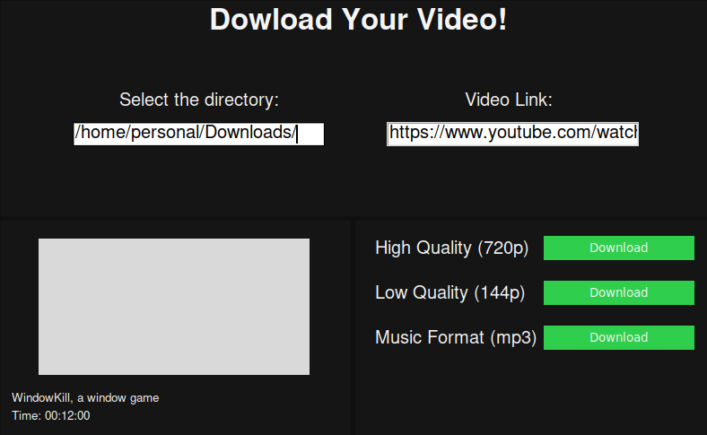

<h1>Youtube Downloader</h1>
Simple youtube downloader application.

<h2>Simple and easy to use</h2>
<ul>
  <li>Type the url.</li>
  <li>Choose and option.</li>
  <li>Watch your video!</li>
</ul>

<h2>Prerequisites</h2>
<ul>
  <li>Python3</li>
  <li>Tkinter</li>
  <li>pytube</li>
  <li>Image & ImageTk</li>
  <li>PIL (pillow)</li>
</ul>

